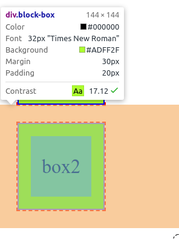
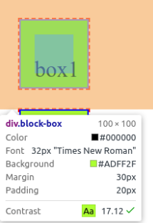
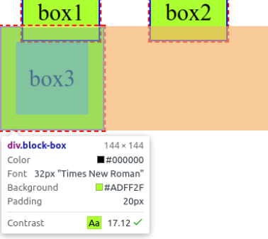
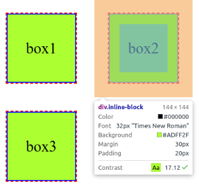
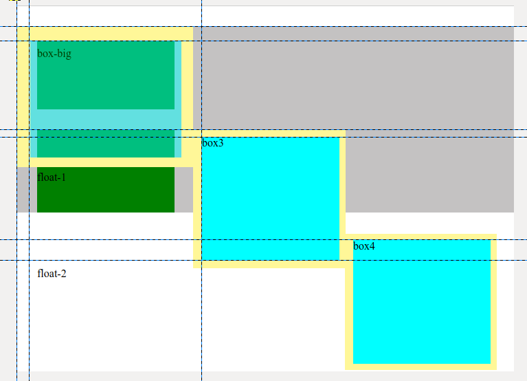

> CSS复习和强化，重新理解CSS的精神，主要针对页面布局和文字排版，记录一些最佳实践
>
> 围绕《精通CSS——高级web标准解决方案》

## 基础知识

之前学习CSS，直接上手，碰到什么居中，布局还有排版问题直接百度，复制粘贴代码过来跑跑，能用了就不再深耕了，这样可能很快，但是自己给自己挖的坑越来越多，这次复习就是希望从原理出发，把坑都填了。

本章涉及HTML和CSS如何保持组织分明且结构良好。

### 代码组织

#### 可维护性

代码是否容易看懂，意图是否明显，是否为**将来的修改做过优化。**

#### HTML和CSS简史

两者关系上经历了以下几个阶段：

1. 1990年创立HTML，最开始的初衷是纯粹的文本标记；
2. 因为各个元素的不同表现（`<blockquote>`具有缩进的效果），开始用一些特殊的标签（`<blockquote>  <tab>`）进行样式的控制（结构和表现没有分离，网页难以阅读，语义很模糊，**不利于SEO**）
3. 提出结构和变现分离，引入了CSS，具有以下优势：充分利用HTML的语义说明页面结构，通过CSS进行样式控制
   - 专门用于样式控制
   - 复用
   - 关注点分离，使代码结构优化

CSS发展大致经历了以下几个阶段

1. CSS1： 1996 只包含字体、颜色和边距等基本的属性
2. CSS2： 1998成为推荐标准，增加了浮动和定位等高级特性，此外还有子选择符、相邻选择符和通用选择符等新选择符
3. CSS2.1（CSS2 Revision 1）：2002修正了CSS2中的一些错误，删掉了支持度不高或者并非所有浏览器都实现了的一些特性
4. CSS3：没有严格的年限，一直在推进，目前很多能够说的上来的特性基本上都是CSS3（**TODO： 好好整理一下CSS3的特性**）

**CSS版本选择**

规范需要经常关注，开发需要关注浏览器的实现，以下几个网址，查询各个属性浏览器的支持情况

- [“Can I use”](https://caniuse.com):可以搜索属性或者属性组
- [W3C联盟的某个项目](https://webplatform.github.io):收集合并CSS、HTML、JS等的支持情况
- [MDN](https://developer.mozilla.org/zh-CN/):老网站了，强烈推荐通刷

其实版本不重要，重要的是准备**后备代码。**下面提供几个小点。

```css
/* 提供浏览器前缀*/
.myThing {
    -webkit-transform: translate(0, 10px);
    -moz-transform: translate(0, 10px);
    -ms-transform: translate(0, 10px);
    transform: translate(0, 10px);
}
/* 条件规则和检查脚本 */
@supports(display: grid) {
    /* 样式 */
}
```

#### 创建结构化、语义化富HTML

**最佳实践：正确使用HTML语义标签进行结构设计，编写CSS的最新实践都建议先给网页一组“基础”样式。**参考[paul lloyd的样式指南](https://v2.paulrobertlloyd.com/about/styleguide#)

**最佳实践：好好给class取名，即使类名明确用于某一个样式，也不要体现出视觉效果，正确的类名的写法是让类名表示组件的类型。**比如`product-list`而非`large-centered-list`；**不建议把ID作为CSS的接入点，ID用于文档中标识元素，但通常不用于添加样式。**

还有一些与HTML扩展语义相关的实践：

- ARIA的role属性
- 微格式（TODO）
- 微数据
- 使用CSS[验证器](https://jigsaw.w3.org/css-validator/)

## 添加样式

> 本章描述如何在HTML接入样式信息，包括选择器以及一些CSS引入的信息

### CSS选择器

介绍最常用的

- 元素选择器

  ```css
  p {
      color: black;
  }
  /*后代选择符*/
  blockquote p {
      padding-left: 10px;
  }
  /*ID选择器*/
  #id {
      padding-left: 10px;
  }
  /*Iclass选择器*/
  .class {
      padding-left: 10px;
  }
  ```

- 子选择符和同辈选择符

  ```css
  /* > 直接后代，不能跨代 */
  #id > h1 {
      padding-left: 10px;
  }
  
  /* + 相邻同辈 */
  #id + h1 {
      padding-left: 10px;
  }
  
  /* ~ 后续的全部同辈 */
  #id ~ h1 {
      padding-left: 10px;
  }
  ```

- 通用选择符

  ```css
  /* *修饰 */
  /* 一般不推荐这么做，会影响全部的元素 */
  * {
      margin: 0l;
      padding: 0;
  }
  /* 麻烦一点，但是推荐 */
  h1, h2, h3, h4, p, div {
      margin: 0l;
      padding: 0;
  }
  ```

  **清除最佳实践：使用[Reset](https://www.npmjs.com/package/reset-css)或者使用[Normalize.css](https://www.npmjs.com/package/normalize.css/v/8.0.1)**

- 属性选择器

  ```css
  /* 具有title的属性的元素,且值为 val:string|Reg|null */
  abbr[title=`${val}`] {
      
  }
  ```

- 伪元素

  选择的区域不是通过元素来表示

  ```css
  /* :: */
  .chapter::before {
      conteny: '"';
      font-size: 15em;
  }
  ```

  `::before ::after`：内容开头和末尾假想的元素

  `::first-letter`：首字母

  `::first-line`：首行

- 伪类

  `:link :visited :hover :focus :active`

- 结构化伪类

  ```css
  /* 4表示第四个被选中，然后已3重复，选择最后一个 */
  tr:nth-child(3n+4) {
      /*样式*/
  }
  ```

- 表单伪类

  HTML5添加了一些属性

  ```html
  <input type="url" name="field-name" required>
  ```

  url 自动验证，`required`

### 层叠与特殊性

#### 层叠

CSS覆盖遵循以下规定，优先级从高到低：

- 标注为`!import`的用户样式
- 标注为`!import`的作者样式
- 作者样式
- 用户样式
- 浏览器默认样式

#### 特殊性

- 4级优先级权限，通配选择器没有优先级
- 伪类 LVHFA
- 继承：任何直接应用给元素的样式都会直接覆盖继承的样式，**浏览器默认样式会覆盖继承样式**
- 引入CSS文件尽量使用`<link>`而不是`@import`

## 可见格式化模型

> 浮动，定位和盒模型是CSS非常重要的概念

### 盒模型

.png)

- 内容区，CSS3默认的width 和 heigh 是的是内容区的大小（看图）**此属性可以修改**
- 白色区域：padding   内边距
- 蓝色：border  边框
- outline：在border外围
  - **不影响盒子的布局，即不影响盒子的高度宽度，常用于调试，展示布局效果**
  - **在focus伪类可能用到此属性，更改聚焦时的样式**

- 透明： margin  外边距

上图还说明了几个问题：

1. padding**不具有自己的background-color属性**，其与content区域背景相同。
2. border具有自己的颜色属性
3. margin不具有自己的颜色属性，而且其是**透明的**（从图上可以看出呈现网格状，这是PS的透明的表示方法）

#### 盒子的大小

此处的盒子的大小，描述盒子在页面中占据的空间，如何控制属性，随意的控制盒子的大小。

首先给出两个需要注意的点：

1. 设置盒子的顶部和底部的内外边距的时候（如果可以设置），如果使用百分比计算，基数是父元素的**宽度**，一定注意，是**宽度**，原因是对于一般块级盒子来说，父元素的高度通常不会声明，随内容变化，因而以高度作为百分比基准，不靠谱；
2. 可以通过`height min-height max-height`声明高度相关的样式，但是，**在CSS中，设置任何高度的时候都需要谨慎，因为元素的高度通常应该取决于包含的内容，不需要明确设定**

下面开始说明盒子大小的问题，盒子大小的参数比较复杂，情况较多，主要还是以`display`属性所展示的盒子的特性进行分类。以下内容主要来源于[MDN](https://developer.mozilla.org/zh-CN/docs/Web/CSS/display)，从中取了比较常用的东西进行总结。

#### `display: none`

不为元素生成盒子，其元素包含的内容不显示，消失，但是其还是在HTML文档中

**此处引入一个知识点，Vue里面v-if和v-show**，详细信息可以参考链接[v-if v-show区别](https://juejin.im/post/5c4ad735518825233b4e980d)

- `v-show`操作的是display属性，元素已经经过vue的编译在文档中存在，只是不显示
- `v-if`元素未编译，且未在文档流中存在，重复切换显示状态会有性能问题

#### `display: block`块级元素

此样式会将元素强制转换为块级元素，举一个大栗子来说明问题

```css
.block-box {
  display: block;
  /* 设置宽度和高度 */
  width: 100px;
  height: 100px;
  /* 内容区颜色 */
  background-color: greenyellow;
  /* 为外边距和边框 */
  border: 2px solid blue;
  outline: 2px dashed red;
  padding: 20px;
  margin: 30px;
  line-height: 100px;
  text-align: center;
}
```

看看效果



上面个盒子被挡住了，现在说明以下几个特性

- block占据的空间为： **内容区+padding + border + margin**（这个地方有个外边距压缩的问题，后面再谈）
- 盒子的标记尺寸：144x144 不计算outline和外边距：100 + (20+2) x 2 = 144
- 独占整行，没有内容的部分用margin填充，图中的橙色部分

- 此处引入一个最佳实践：使用`box-sizing: border-box;`属性，可以将pading和border算入标记尺寸的空间，此有利于布局

  

  标记尺寸变为100了，但是其实际占据的空间还是要计算margin，而且，**我使用`line-height`实现单行文字的垂直居中，其基准线为内容区的上界，**因而图中文字的内容下移

#### `display: inline`行内元素

```css
.block-box {
  /* box-sizing: border-box; */
  display: block;
  /* 设置宽度和高度 */
  width: 100px;
  height: 100px;
  /* 内容区颜色 */
  background-color: greenyellow;
  /* 为外边距和边框 */
  border: 2px solid blue;
  outline: 2px dashed red;
  padding: 20px;
  margin: 00px;
  line-height: 100px;
  text-align: center;
}
.inline {
  box-sizing: border-box;
  display: inline;
  /* 设置宽度和高度 */
  width: 100px;
  height: 100px;
  /* 内容区颜色 */
  background-color: greenyellow;
  /* 为外边距和边框 */
  border: 2px solid blue;
  outline: 2px dashed red;
  padding: 20px;
  margin: 30px;
  /* line-height: 100px; */
  text-align: center;
}
```

贴上对应的HTML

```html
<div class="block-test">
    <div class="inline-block">box1</div>
    <div class="inline-block">box2</div>
    <div class="block-box">box3</div>
 </div>
```

效果图：



这俩放在一起就很有意思了，行内元素有以下几个特点：

- 水平方向上，padding，border和margin设置生生效（margin折叠后面一起说）

- 垂直方向上，只计算内容区的高度，**内容区只受到`line-height`的影响**

  可以看到，inline 的padding依旧存在，有颜色，但是其没有占据文档流的空间

  下面的block的上边界顶到inline元素

#### `display: inline-block`

```css
.block-box {
  /* box-sizing: border-box; */
  display: inline-block;
  /* 设置宽度和高度 */
  width: 100px;
  height: 100px;
  /* 内容区颜色 */
  background-color: greenyellow;
  /* 为外边距和边框 */
  border: 2px solid blue;
  outline: 2px dashed red;
  padding: 20px;
  margin: 30px;
  line-height: 100px;
  text-align: center;
}
```



其中box1 box2为inline-block，box3为block，三个box全为同辈元素

可以看出，inline-block具有以下特点

- 以实际占据尺寸（计算margin的尺寸）水平排列，排列参考inline
- 大小可以有宽度和高度属性调整，尺寸计算参考block

### 浮动与外边距折叠

> 浮动是样式排布最常用的属性，也是最常被误用的属性，这里面还涉及外边距折叠的问题

看这个例子，自己别写这么恶心的代码

```html
<div class="block-test">
    <div class="box-big">box-big</div>
    <div class="box">float-1</div>
    <div class="box-float">box3</div>
    <div class="box">float-2</div>
    <div class="box-float">box4</div>
 </div>
```

```css
.block-test {
  padding: 0px;
  margin: 0px;
  background-color: rgb(196, 194, 194);
}
.box-big {
  background-color: aqua;
  width: 200px;
  height: 150px;
  margin: 20px;
  padding: 10px;
  float: left;
  opacity: 0.5;
}
.box {
  background-color: green;
  width: 200px;
  height: 120px;
  margin: 30px;
  /* float: left; */
}
.box-float {
  background-color: aqua;
  width: 200px;
  height: 180px;
  margin: 10px;
  float: left;
}
```

看看效果



为了凸显效果，我把网页的边距也截图下来了，还画了点辅助线

- 竖辅助线从左往右命名为c1,c2,c3
- 横辅助线从上到下命名为r1,r2,r3,r4,r5,r6。
- 黄色为我手画的float盒子的外边距

**现在开始讨论**

- 外边距折叠问题

  首先提一个问题：我将body和最外层的div .block-test 设置了内外边距为0，最外层div上方(r1上方)为什么有30px的间隙？

  > 可以看出来，最外层盒子不是从0px开始的，这是由于外层盒子嵌套的第一个盒子存在上外边距，这种情况下，外边距为二者的最大值，即 max(0px, 30px) = 30px，所以无形中给最外层盒子加上了30px的外边距，导致上方空隙的出现。

  **外边距折叠：**只发生在文档常规流中块级盒子的垂直方向上。

  > 所以block-test盒子上边距折叠，左右边距未发生折叠，左右从0px的位置开始。

  **经验：如果出现页面上面出现奇怪的缝隙，可能就是内部嵌套的元素使外层块折叠**

- 浮动的盒子怎么这么奇怪哦

  先把浮动盒子的特性丢出来：

  - 脱离文档流，盒子内容区大小可设置

