> 实习项目之一：简单的代码编辑器的实现

## 编辑器布局设计

在实现上，打算参考vscode的编辑器风格进行设计，因为此为初代版本，没有命令行窗口之类的进行加持，页面布局如下。

项目除必要地方（如：核心编辑器）采用第三方代码编写外，其余地方均采用原生TS的方式进行编写。

### html部分

```html
<!DOCTYPE html>
<html lang="en">
<head>
    <meta charset="UTF-8">
    <meta name="viewport" content="width=device-width, initial-scale=1.0">
    <title>Electron Editor</title>
    <link rel="stylesheet" href="./app/main.css">
</head>
<body>
  <header class="editor-header">
    菜单栏
  </header>
  <section class="editor">
    <div class="source-container">资源管理器</div>
    <div class="code-container">
      <div class="codefile-list">已打开代码文件列表</div>
      <div class="codefile-content">代码区</div>
    </div>
  </section>
</body>
<script>
  require('./dist/rendered.js')
</script>
</html>
```

### 样式设计

此页面布局很简单，作为练手项目，下面介绍几种布局方式。

#### 绝对定位布局

从页面的HTML代码可以看出，界面元素嵌套模式比较简单，最多存在两个同辈元素，唯一的难点是需要将div铺满页面，最容易想到的方法是决定定位的方法，通过top等间距控制，css代码如下，各个参数的设计详见注释。

```css
body, div {
    /* 清除边界样式 */
    margin: 0px;
    padding: 0px;
    /* 使用boder盒子模型 */
    box-sizing: border-box;
    /* 采用系统自带字体，保证UI一致性 */
    font-family: menu;
}

body {
    /* 保证最外框的高度是确定的，作为后续使用百分比进行高度设定的时候基数存在 */
    min-height: 100vh;
}

.editor-header {
    background-color: #CDEB8B;
    height: 30px;
    text-align: center;
}

/* editor内部采取绝对布局的方式，利用top等属性进行边界控制 */
.editor {
    width: 100%;
    position: absolute;
    /* 整个代码编辑部分高度减去标题头部的30px */
    top: 30px;
    /* 保证内容部分能够自动填充页面剩余部分 */
    bottom: 0px;
    background-color: azure;
}

.source-container {
    /* 资源管理侧边栏宽度固定，后期改为动态 */
    width: 200px;
    /* 此时百分比设置有参考高度，有效 */
    min-height: 100%;
    background-color: #F5F5F5;
    position: absolute;
}

.code-container {
    position: absolute;
    /* 通过控制左侧的间距，排满页面 */
    left: 200px;
    right: 0px;
    height: 100%;
}

.codefile-list {
    background-color: #2A2A2A;
    width: 100%;
    color: white;
    opacity: 0.6;
    height: 30px;
}

.codefile-content {
    position: absolute;
    width: 100%;
    top: 30px;
    /* 排满高度 */
    bottom: 0;
    background-color: #F8CECC;
}
```

#### 使用flexbox进行布局

因为本布局存在伸缩扩展至整个页面的需求，flex同样很满足需求，代码如下，关键参数详见注释。

```css
body, div {
    /* 清除边界样式 */
    margin: 0px;
    padding: 0px;
    /* 使用boder盒子模型 */
    box-sizing: border-box;
    /* 采用系统自带字体，保证UI一致性 */
    font-family: menu;
}

body {
    /* 保证最外框的高度是确定的，作为后续使用百分比进行高度设定的时候基数存在 */
    min-height: 100vh;
    /* 最外层采取纵向排列，设置主轴方向 */
    display: flex;
    flex-direction: column;
}

.editor-header {
    background-color: #CDEB8B;
    height: 30px;
    text-align: center;
}

/* editor内部采取绝对布局的方式，利用top等属性进行边界控制 */
.editor {
    /* 扩展剩余的区域 */
    flex-grow: 1;
    background-color: azure;
    /* 内部开启横向的flex布局 */
    display: flex;
}

.source-container {
    /* 资源管理侧边栏宽度固定，后期改为动态 */
    width: 200px;
    background-color: #F5F5F5;
}

.code-container {
    /* 扩展剩余的空间 */
    flex-grow: 1;
    display: flex;
    flex-direction: column;
}

.codefile-list {
    background-color: #2A2A2A;
    width: 100%;
    color: white;
    opacity: 0.6;
    height: 30px;
}

.codefile-content {
    background-color: #F8CECC;
    /* 扩展剩余的空间 */
    flex-grow: 1;
}
```

## 代码编辑器部分

