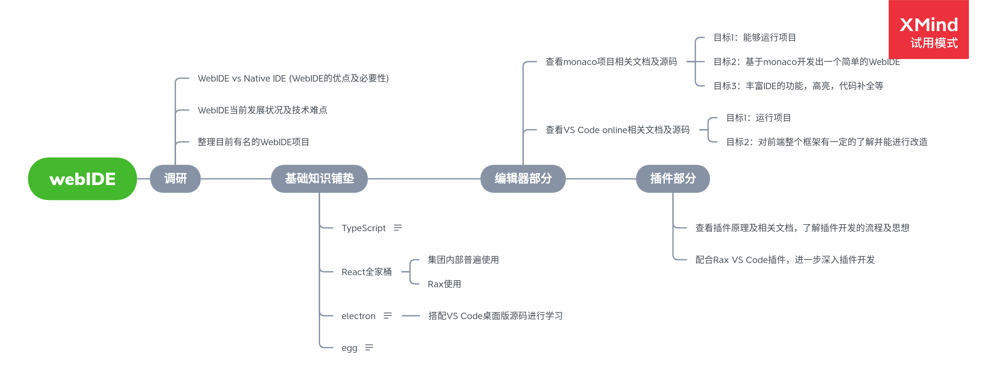

> 本次实习与WebIDE相关，此处记录部门分配任务、个人时间安排及任务完成情况

<!-- more -->

# 实习任务

实习任务图谱：

## 具体时间安排

|       时间        |                           内容                           | 具体时间安排                                    |
| :---------------: | :------------------------------------------------------: | ----------------------------------------------- |
| 4月26日至4月29日  |                     项目相关内容调研                     |                                                 |
| 4月29日至5月24日  | 基础内容铺垫（对基本概念详细了解，后期结合项目深入学习） | React全家桶学习: 4月29日至5月10日               |
|                   |                                                          | TS学习：5月11日至5月14日                        |
|                   |                                                          | electron学习：5月15日至5月20日                  |
|                   |                                                          | egg学习：5月21日至5月24日                       |
| 5月25日至6月14日  |                      编辑器部分学习                      | monaco学习：5月25日至5月31日                    |
|                   |                                                          | VS Code online学习：6月1日至6月7日              |
|                   |                                                          | 备用时间及总结：6月8日至14日                    |
| 6月15日至现场实习 |                         插件部分                         | 此部分了解不足，在对IDE有详细了解后制定详细计划 |

## 工作详细记录

### 调研

- 4月27日：对比本地IDE和WebIDE的优缺点，结合公司需求总结发展WebIDE的必要性
- 4月28日：大范围搜索WebIDE相关的信息，整理目前比较有名的WebIDE项目

### 基础知识整理

- 4-29日-五一假前：掌握React的基本语法，JSX的语法，React脚手架
- 5月6日-5月7日：掌握React路由
- 5月8日：学习Redux和TS基础(查看TS类型相关的内容)
- 5月9日: 完成Redux的学习,继续学习TS
- 5月10日-5月12日：基本完成TS的学习，插入一个临时任务：**使用conteneEditable属性和TS完成一个简单的web编辑器**
- 5月13日：完成简单web编辑器的布局，研究代码高亮和自动补全
- 5月14日：汇报进度，收到建议：**不要执着于在web中实现，可以先看electron，然后利用electron和ts实现类vscode编辑器**